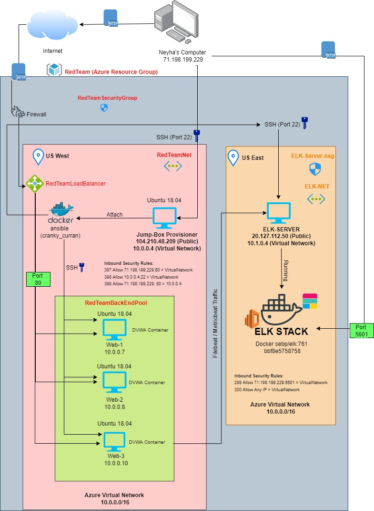

## Automated ELK Stack Deployment

The files in this repository were used to configure the network depicted below.

These files have been tested and used to generate a live ELK deployment on Azure. They can be used to either recreate the entire deployment pictured above. Alternatively, select portions of the YAML files may be used to install only certain pieces of it, such as Filebeat.

  Please refer to my Ansible folder to see the playbook YAML files.

This document contains the following details:
- Description of the Topology
- Access Policies
- ELK Configuration
  - Beats in Use
  - Machines Being Monitored
- How to Use the Ansible Build

### Description of the Topology

The main purpose of this network is to expose a load-balanced and monitored instance of DVWA, the D*mn Vulnerable Web Application.

Load balancing ensures that the application will be highly available, performant, in addition to restricting traffic to the network.

Load balancers protect the availability aspect of security. Jump Boxes are used to control access to devices in a separate environment. Because Jump Boxes are hardened and can be monitored, access between the zones is more controlled / secure. 

Integrating an ELK server allows users to easily monitor the vulnerable VMs for changes to the data and system logs.

Filebeat is lightweight shipper used to forward and cetnralize log data. Once installed on your server, Filebeat monitors log files and locations, collects log events and then forwards them on to Elasticsearch.

Metricbeat also collects logs, but specifically metrics of the logs and then forwards that along to Elasticsearch.

The configuration details of each machine may be found below.
_Note: Use the [Markdown Table Generator](http://www.tablesgenerator.com/markdown_tables) to add/remove values from the table_.

| Name     | Function | IP Address | Operating System |
|----------|----------|------------|------------------|
| Jump Box | Gateway  | 10.0.0.1 | Linux |
| Web-1   | DVWA Container Server | 10.0.0.7 | Linux |
| Web-2    | DVWA Container Server | 10.0.0.8 | Linux |
| Web-3   | DVWA Container Server | 10.0.0.10 | Linux              |

### Access Policies

The machines on the internal network are not exposed to the public Internet. 

Only the load balancer can accept connections from the Internet. Access to this machine is only allowed from the following IP addresses:

13.83.42.169

Machines within the network can only be accessed by the Jump Box.

I also allowed the JumpBox to access the ELK VM. Private IP for Jump Box 10.0.0.4.

A summary of the access policies in place can be found in the table below.

| Name     | Publicly Accessible | Allowed IP Addresses |
|----------|---------------------|----------------------|
| Jumpbox  | Yes | 71.198.199.229:80 |
|Web-1 |  No  | 10.0.0.4:22  |
| Web-2| No  | 10.0.0.4:22  |
| Web-3 | No | 10.0.0.4:22|
| 300 ELKServer | Yes | 71.198.199.229.80 / 10.0.0.4:22
### Elk Configuration

Ansible was used to automate configuration of the ELK machine. No configuration was performed manually, which is advantageous because it allows for precise representation of code, specifically Infrastructure as Code (IAC). This ensures smooth provisioning and management of the server.

The playbook implements the following tasks:

Install ELK, install Python3-pip3, install Docker Python Module, increase virtual memory, download and launch Docker ELK container, enable service Docker on Boot.

The following screenshot displays the result of running `docker ps` after successfully configuring the ELK instance.

### Target Machines & Beats
This ELK server is configured to monitor the following machines:

Web-1: 10.0.0.7
Web-2: 10.0.0.8
Web-3: 10.0.0.10

We have installed the following Beats on these machines:

Metricbeat and Filebeat.

These Beats allow us to collect the following information from each machine:
Metricbeat is used to collect metric data from your target servers, such as operating system info, CPU or memory data. Filebeat is used as a general log collector. Both are considered very lightweight.

### Using the Playbook
In order to use the playbook, you will need to have an Ansible control node already configured. Assuming you have such a control node provisioned: 

SSH into the control node and follow the steps below:
- Copy the configuration file to Jump-Box Provisioner's /etc/ansible/files.
- Update the host file to include IP addresses of the target machines within the correct host group.
- Run the playbook, and navigate to ELK Server Kibana GUI data installation page to check that the installation worked as expected.

